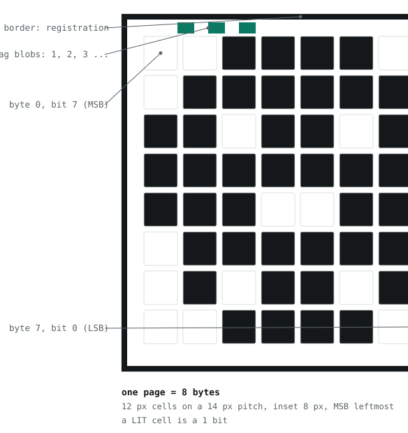

<picture>
  <source media="(prefers-color-scheme: dark)" srcset="docs/img/grid-dark.svg">
  
</picture>

# dc34badge

Capturing both secrets from the DEF CON 34 Baosec-lite badge without entering
developer mode, explained from scratch.

That grid above is not decoration. It is eight bytes in exactly the format this
project's payloads use to get data off the badge: one byte per row, most
significant bit on the left. The badge has no usable serial port, so every value
here came off a 128x128 OLED, one 8-byte page at a time, photographed with a
phone. The bytes happen to draw a skull.

> [!IMPORTANT]
> **Published with the badge author's permission, August 2026.**
> Everything here was disclosed privately to Andrew "bunnie" Huang first and held
> under embargo until he lifted it. He has confirmed the findings and has fixes in
> progress. Two things are still withheld and are not in this repository: the value
> of THE_FLAG_1, which is a game prize and someone else's to find, and anything
> that would spoil a puzzle rather than explain a technique.
>
> The exchange key **Ko** is published, separately, at
> [nastea1/dc34-gamete](https://github.com/nastea1/dc34-gamete) along with a browser
> tool that uses it. That release was cleared at the same time.

> [!NOTE]
> **This describes real defects in shipped hardware.** One of them, the RRAM
> instruction-fetch behaviour in [docs/05-fetch-acl-bypass.md](docs/05-fetch-acl-bypass.md),
> is in silicon and cannot be fixed in firmware on badges already in the field.
> Read it as an explanation of how the part behaves, not as an invitation to go
> after anyone else's device.

> [!WARNING]
> **Never enter developer mode.** It is a one-way door. It erases the badge's
> secrets, including the flag and the shared exchange key, and there is no way
> back. Holding a face button at cold boot reaches **boot1 update mode**, which
> is a different and safe state. Verify which one you are in before typing
> anything: update mode enumerates as `Baochip_1x`, a normal boot as
> `Baosec_lite`.

## Related

The light gene exchange itself, the key it uses, and a browser tool that mints a
valid gamete from a photo: [nastea1/dc34-gamete](https://github.com/nastea1/dc34-gamete).
That repository documents the protocol and publishes Ko. This one explains how the
badge's secrets were recovered in the first place.

## What is here

Two things are recoverable from a sealed badge, and this repo covers both.

| | What it is | Walkthrough |
|---|---|---|
| **THE_FLAG_1** | A 32-byte value in keystore slot 260, guarded by hardware access control | [docs/01-flag1.md](docs/01-flag1.md) |
| **Ko** | The secret shared by every badge, which encrypts the light-pattern exchange | [docs/02-ko.md](docs/02-ko.md) |

A second, independent vulnerability found along the way, this one in silicon, is in
[docs/05-fetch-acl-bypass.md](docs/05-fetch-acl-bypass.md): instruction fetches read RRAM with
no access control at all.

Pitfalls that cost boot cycles are in [docs/03-troubleshooting.md](docs/03-troubleshooting.md).
Whether any of this still applies to current firmware is in
[docs/04-upstream-status.md](docs/04-upstream-status.md): as of 2026-08-07, **it does**.

There is no third flag. `THE_FLAG_1` is the only flag slot in the firmware
(`offsets/baosec.rs:131`), and the design document calls Ko the other one at
`defcon-scheme.md:114`. Time was spent hunting a hidden third secret in RRAM, in
the factory-programmed region, and in the shipped bitmaps. It was never there.

**No recovered values appear anywhere in this repo.** Not the flag, not Ko, not
the master key, not the badge UUID. Everything here is method and tooling, so it
works on your badge and leaks nobody's keys. The Ko payload rebuilds the master
key from your own keystore at runtime rather than carrying one.

## The short version

The loader's signature covers everything from byte 132 onward. The first 132
bytes are excluded, because that space holds the signature. But byte 0 of that
unsigned region is a jump instruction, and it is the first thing executed once
the signature check passes.

Boot1 has a `uf2` command that writes RRAM with no signature check at write time.
So you overwrite that one jump instruction with your own, and the badge runs your
code in machine mode while still believing it is Sealed.

Then the actual subtlety. Machine mode is not enough to read the keystore. The
guard cares which *identity* is asking, and works it out from the paging setup.
`boot1/src/secboot.rs:17` says you must enter a virtual memory **user** state.
In RISC-V, S-mode is *supervisor*, and S-mode at ASID 3 returns all zeros
without faulting. Only **U-mode at ASID 3** works, because that is where the
badge's own keystore service runs. You are not breaking the guard. You are using
machine mode to build exactly the context it trusts.

## Layout

```
payload/          the two stage-2 payloads (Rust, no_std, riscv32imac)
  src/bin/flag1.rs    read keystore slot 260 from U-mode
  src/bin/ko.rs       derive master key, unwrap basis key, sweep the PDDB
  src/common.rs       OLED page rendering, CRC, allocator
  src/ko.rs           AES-KWP unwrap, AES-GCM-SIV, the search oracle
  payload.x           linker script. the KERNEL_START ceiling lives here.
tools/
  uf2send.py          write RRAM over USB serial, with guards
  elf2bin.py          flatten the ELF, refuse to build a bricking image
  decode.py           photo of a page -> 8 bytes
  assemble.py         stitch flag pages, verify against the on-chip CRC
  verify_ko.py        check Ko against the published oracle, read the diagnostics
docs/
  01-flag1.md         full walkthrough
  02-ko.md            full walkthrough
  03-troubleshooting.md   everything that cost us a boot cycle
  flag1.html, ko.html     the same two walkthroughs, styled
```

## Setup

You need a Baosec-lite badge with removable AA cells, a USB-C cable, Rust with
the `riscv32imac-unknown-none-elf` target, Python, and a phone camera.

```sh
rustup target add riscv32imac-unknown-none-elf
python3 -m venv .venv && .venv/bin/pip install -r tools/requirements.txt
```

Then pin a checkout of the badge firmware to the commit **your** badge actually
runs. This is not optional: constants, offsets and line numbers move between
versions, and every citation in these docs is against the badge's own commit.
Check your badge's version banner first, then:

```sh
git clone https://github.com/betrusted-io/xous-core.git
git -C xous-core worktree add ../xous-BADGE <your-badge-commit>
```

The payload crate expects that worktree at `../xous-BADGE` relative to
`payload/`, which is the repo root. It is gitignored.

## Build

```sh
cd payload
cargo build --release --bin flag1
python3 ../tools/elf2bin.py target/riscv32imac-unknown-none-elf/release/flag1 flag1.bin
```

`elf2bin.py` asserts the image starts at `0x60090000` and ends before
`KERNEL_START` at `0x60099000`. Let it. Reaching that address overwrites
`xous.img` and bricks the badge, and it is the one mistake this repo cannot help
you undo.

## Run

Cold boot into update mode: both AA cells out, USB unplugged about 30 seconds,
then hold a face button while replugging. The cells genuinely have to come out,
because `warm_boot` is set on every OS start and clears only on full power loss.
Confirm you see `Baochip_1x`, then:

```sh
python3 tools/uf2send.py file 0x60090000 payload/flag1.bin
python3 tools/uf2send.py word 0x60060000 0003006F   # retarget the jump
```

Power cycle with no button held. Photograph the pages. Then always, without
exception, put it back:

```sh
python3 tools/uf2send.py word 0x60060000 3000006F   # restore
```

## How the output works

<picture>
  <source media="(prefers-color-scheme: dark)" srcset="docs/img/page-format-dark.svg">
  
</picture>

Each page holds eight bytes. The lit border is what makes handheld photos work:
it pins the origin and the scale so cell bloom cannot walk the sampling grid off
by a row. The blobs in the top margin count the page number.

**Page 2 is always your control.** It renders eight bytes of your badge's UUID
slot, which you already know. If it decodes wrong, throw the entire photo set
away rather than trying to rescue the interesting pages from it.

```sh
python3 tools/decode.py page*.jpg
```

## The one habit that matters

Every wrong conclusion in this project came from the same mistake: treating an
absence as a measurement.

A denied keystore read returns **zeros and does not fault**, which is
indistinguishable from a bug in your own code. A flash read on a misconfigured
bus returns **all `0xff`**, which is indistinguishable from an empty chip. Both
of those produced confident, wrong, written-down conclusions here.

The fix is to read something whose answer you already know, in the same breath,
every time. And the control has to be in the *same class* as the claim: the UUID
slot is `PartitionAccess::Open`, readable by everyone, so passing it proves your
user-mode context exists but says nothing at all about the protected slots.
That specific error survived two documents before an AES key-unwrap integrity
check finally settled it.

## Credits

Badge, firmware and the game design by bunnie and the Baochip team. It is an
excellent piece of hardware, and the failure modes taught more than the
successes did.
